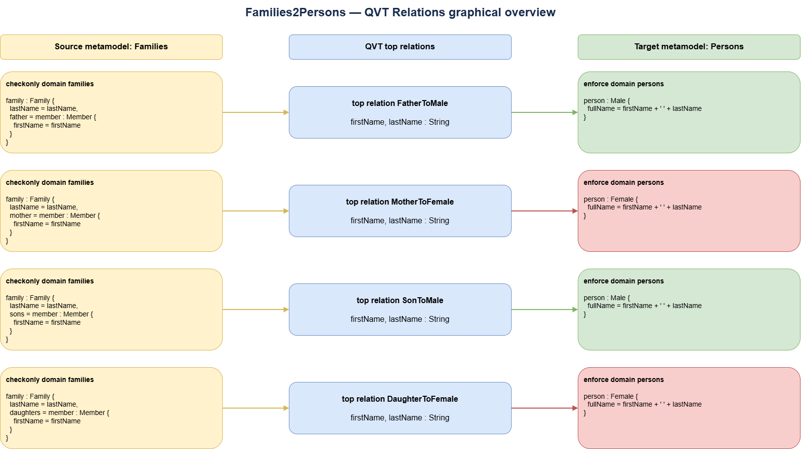

# Homework 3 — Families to Persons with QVT Relations

## Assignment

Express the Families-to-Persons model transformation through the QVT
Relations Language and/or the graphical syntax for QVT.

This solution provides:

- the source and target Ecore metamodels;
- a textual QVT Relations transformation;
- a graphical overview of the four transformation relations.

## Transformation overview

The source model contains families and their members. A member's role in a
family determines the concrete class created in the target model.

| Source role | Target class | Target value |
| --- | --- | --- |
| Father | `Male` | `firstName + " " + lastName` |
| Son | `Male` | `firstName + " " + lastName` |
| Mother | `Female` | `firstName + " " + lastName` |
| Daughter | `Female` | `firstName + " " + lastName` |

For example, a father named `Mario` in the `Rossi` family produces a `Male`
object whose `fullName` is `Mario Rossi`.

## Metamodels

The source metamodel, [`Families.ecore`](metamodels/Families.ecore), defines:

- `Family`, with a last name and the roles `father`, `mother`, `sons`, and
  `daughters`;
- `Member`, with a first name and opposite references to the family role held
  by that member.

The target metamodel, [`Persons.ecore`](metamodels/Persons.ecore), defines an
abstract `Person` with a `fullName` attribute and the concrete subclasses
`Male` and `Female`.

## QVT Relations transformation

[`Families2Persons.qvtr`](transformation/Families2Persons.qvtr) contains four
top-level relations:

- `FatherToMale`;
- `MotherToFemale`;
- `SonToMale`;
- `DaughterToFemale`.

Each relation uses a `checkonly` domain to match a structure in the source
`Families` model and an `enforce` domain to require the corresponding object in
the target `Persons` model.

The explicit four-relation design keeps role selection visible and avoids
additional OCL helper queries.

## Graphical overview

<p align="center">
  
</p>

The editable source is available in
[`diagrams/Families2Persons.drawio`](diagrams/Families2Persons.drawio).

The diagram mirrors the textual transformation: each row connects one source
pattern, one top relation, and one enforced target pattern.

## Project structure

```text
Homework3_Matteo_Carrese/
├── README.md
├── metamodels/
│   ├── Families.ecore
│   └── Persons.ecore
├── transformation/
│   └── Families2Persons.qvtr
└── diagrams/
    ├── Families2Persons.drawio
    └── Families2Persons.png
```

The `.ecore` files can be inspected with Eclipse Modeling Tools or as XML. The
`.drawio` file can be opened with diagrams.net or the Draw.io Integration
extension for Visual Studio Code.

## Validation note

The metamodels and diagram were checked for XML correctness, and the QVT-R file
was checked structurally against their classes, references, and attributes.
Running the transformation requires a compatible QVT Relations engine, such as
Eclipse QVTd.

