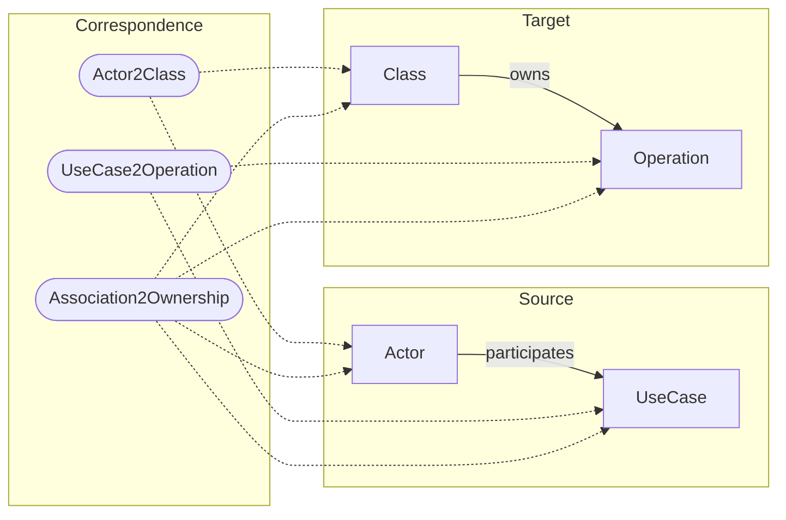

# Homework 5 — UCD to CD Triple Graph Grammar

## Assignment

Construct a Triple Graph Grammar (TGG) in AGG that transforms a UML Use Case
Diagram into a UML Class Diagram.

## Proposed transformation

The grammar uses three connected domains:

- the **source graph** contains `Actor`, `UseCase`, and `participates`;
- the **correspondence graph** records the mappings between source and target
  elements;
- the **target graph** contains `Class`, `Operation`, and `owns`.



The transformation copies names from source elements to their corresponding
target elements.

| Source pattern | Correspondence | Target result |
| --- | --- | --- |
| `Actor(name)` | `Actor2Class` | `Class(name)` |
| `UseCase(name)` | `UseCase2Operation` | `Operation(name)` |
| `Actor participates UseCase` | `Association2Ownership` | `Class owns Operation` |

## Rules

### 1. `ActorToClass`

The rule matches an `Actor`, creates a `Class` with the same name, and links
both nodes through `Actor2Class`.

### 2. `UseCaseToOperation`

The rule matches a `UseCase`, creates an `Operation` with the same name, and
links both nodes through `UseCase2Operation`.

### 3. `AssociationToOwnership`

The rule matches an `Actor` associated with a `UseCase` after both elements
have been transformed. It creates an `owns` edge from the corresponding
`Class` to the corresponding `Operation` and records the relation through
`Association2Ownership`.

Each operational rule has a Negative Application Condition (NAC). A rule is
therefore disabled when the corresponding trace already exists. This avoids
duplicate target elements and makes repeated execution terminate.

## Example

The AGG host graph represents a small online shop:

- `Customer` participates in `Browse catalog` and `Place order`;
- `Administrator` participates in `Manage catalog`.

After all rules are applied, the target model contains:

- class `Customer`, owning operations `Browse catalog` and `Place order`;
- class `Administrator`, owning operation `Manage catalog`.

The source graph is preserved and the correspondence nodes provide explicit
traceability to the generated class diagram.

## Files

```text
Homework5_Matteo_Carrese/
├── agg/
│   └── UCD2CD_TGG.ggx
├── output/
│   └── pdf/
│       └── Homework5_UCD2CD_TGG_Report.pdf
├── report/
│   ├── images/
│   │   ├── 01_type_graph.png
│   │   ├── 02_initial_host_graph.png
│   │   ├── 03_association_nac_lhs.png
│   │   ├── 04_association_rhs.png
│   │   └── 05_transformation_result.png
│   └── main.tex
├── tools/
│   └── build_agg.py
├── README.md
└── STUDY_NOTES_IT.md
```

The short illustrated report is available at
`output/pdf/Homework5_UCD2CD_TGG_Report.pdf`. Its LaTeX source and the original
AGG screenshots are kept under `report/`.

## Open and execute in AGG

1. Start AGG.
2. Select **File → Open**.
3. Open `agg/UCD2CD_TGG.ggx`.
4. Inspect the type graph and the initial host graph.
5. Apply the rules in layer order: `ActorToClass`,
   `UseCaseToOperation`, and `AssociationToOwnership`.
6. Continue until no rule is applicable.

The generated grammar can be rebuilt with:

```bash
python tools/build_agg.py
```

## Scope

This homework focuses on the core mapping between use case and class diagrams.
Relationships such as `include`, `extend`, and generalization can be added with
new source, correspondence, and target types without changing the three-domain
architecture.
